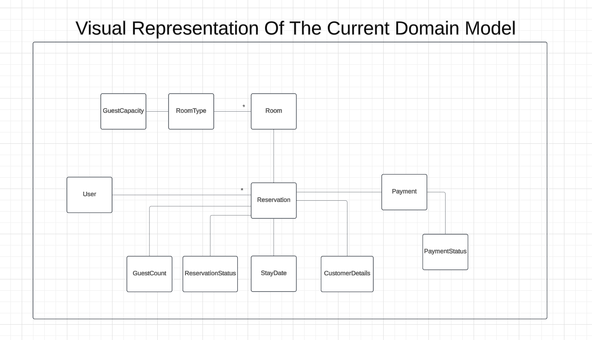
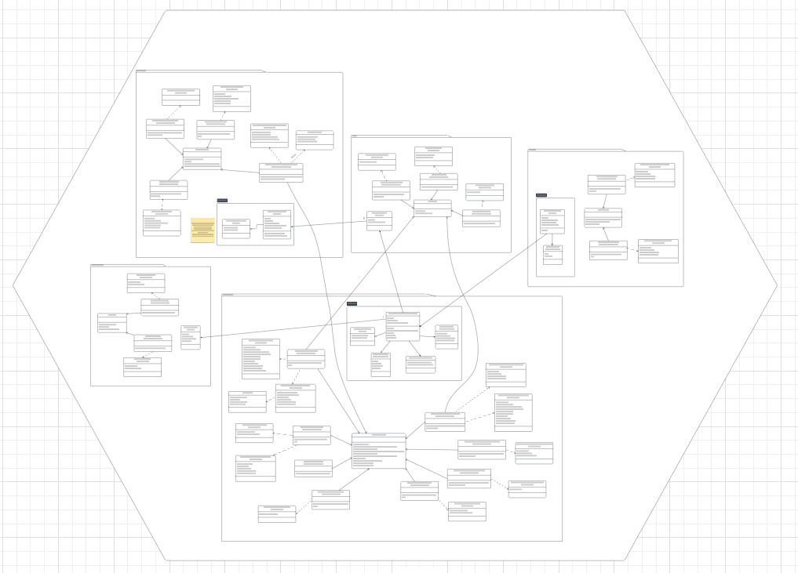
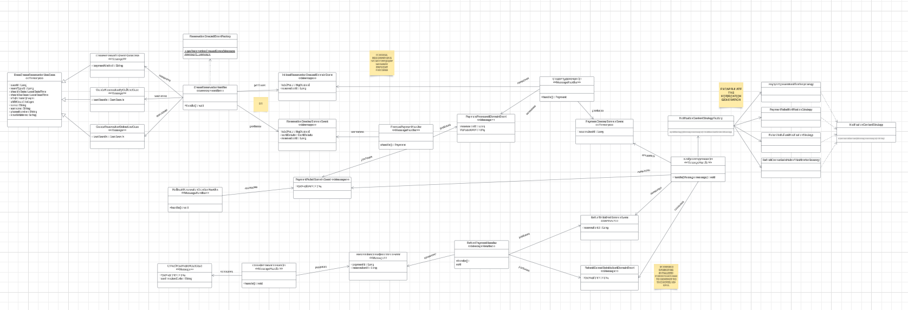
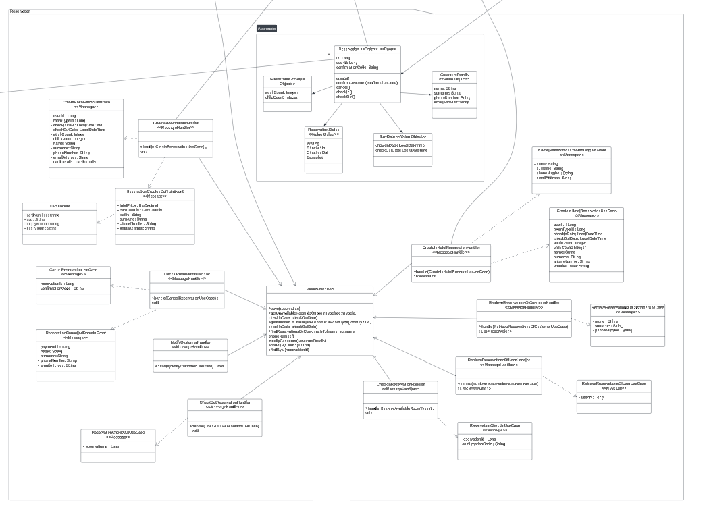
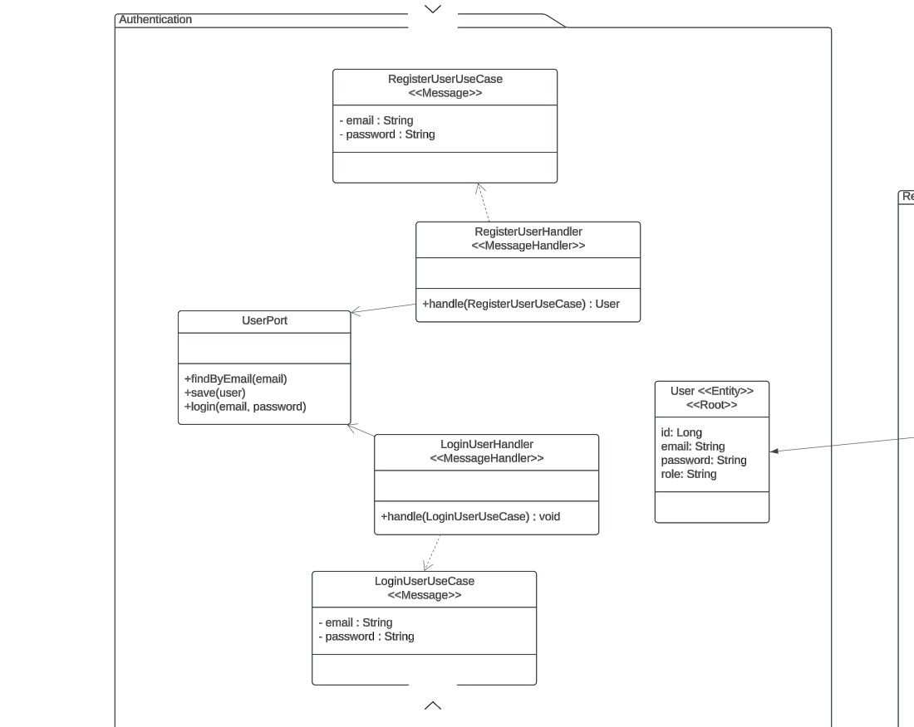
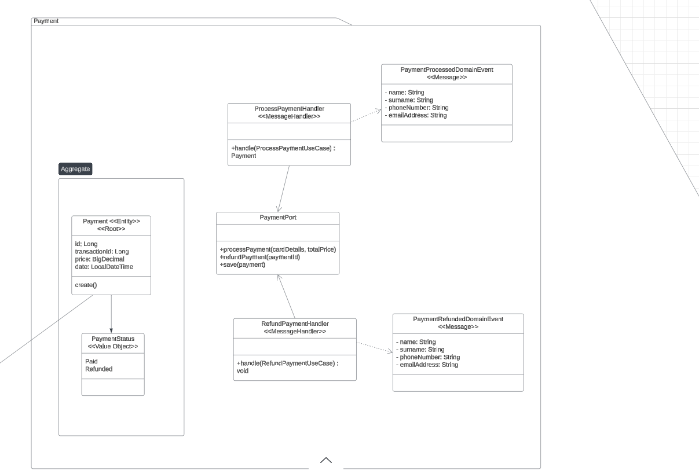
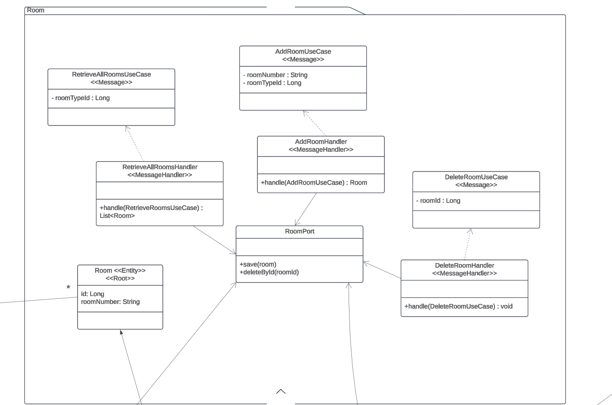

# Hotel Reservation System

A software system for an imaginary hotel. Supports in-hotel, call and online reservation. Intentionally over-engineered. 

If you want to take a closer look at the UML design, you can visit it <a href="https://lucid.app/lucidchart/e0c57e48-c5d1-4812-af3d-4a13d766994e/edit?viewport_loc=-9506%2C-4956%2C31791%2C14162%2C0_0&invitationId=inv_7089af6c-d665-4f91-8786-333e7d46c243" target="_blank">here.</a>

# Scenarios

## Reservation with Call

1. Customer calls the hotel.
2. Receptionist asks the customer, "How can I help you, sir?"
3. Customer says, "I want to reserve a room."
4. Receptionist asks, "Can you specify the stay date and the number of guests, sir?"
5. Customer specifies the stay date and the number of guests (number of adults and children separately).
6. Receptionist retrieves all available room types with:
   - Number of remaining rooms.
   - Potential total price of each room type.
7. Receptionist explains to the customer all the available room types.
8. Customer chooses a room type.
9. Receptionist asks for the customer's:
   - Name, surname.
   - Phone number, email address.
   - Card information for payment.
10. Customer provides the requested information.
11. Receptionist makes the reservation in the system and says:
    - "Your reservation has been completed successfully, sir. The confirmation code and all other information will be sent to your phone number and email."
12. Call ends.

### Use Cases Involved
- `RetrieveAvailableRoomTypes`
- `CreateReservation`
- `ProcessPayment`
- `NotifyCustomer`

 

## Online Reservation

1. Customer logs in to the system.
2. Customer searches for available rooms by specifying:
   - Stay date.
   - Number of guests (number of adults and children separately).
3. System retrieves all available room types with:
   - Number of remaining rooms.
   - Potential total price of each room type.
4. Customer selects a room type.
5. Customer enters:
   - Personal information.
   - Payment information.
6. Customer completes the reservation.

### Use Cases Involved
- `Login`
- `RetrieveAvailableRoomTypes`
- `CreateReservation`
- `ProcessPayment`
- `NotifyCustomer`

 

## Face-to-Face Reservation (Typically Same-Day Check-In)

1. Customer enters the hotel for a face-to-face reservation.
2. Receptionist asks the customer, "How can I help you, sir?"
3. Customer says, "I want to reserve a room."
4. Receptionist asks, "Can you specify the stay date and the number of guests, sir?"
5. Customer specifies the stay date and the number of guests (number of adults and children separately).
6. Receptionist retrieves all available room types with:
   - Number of remaining rooms.
   - Potential total price of each room type.
7. Receptionist explains to the customer all the available room types.
8. Customer chooses a room type.
9. Receptionist asks for the customer's:
   - Name, surname.
   - Phone number, email address.
10. Customer provides the requested information.
11. Receptionist makes the reservation in the system and says:
    - "Your reservation has been completed successfully, sir. The confirmation code and all other information will be sent to your phone number and email."
12. Receptionist collects payment (either via cash or card).
13. Customer leaves.

### Use Cases Involved
- `RetrieveAvailableRoomTypes`
- `CreateInHotelReservation`
- `NotifyCustomer`

 

## Cancellation by Call

1. Customer calls the hotel.
2. Customer provides their information and specifies the reservation to cancel.
3. Receptionist searches for reservations using the customer’s information and finds the reservation to cancel.
4. Receptionist asks for the confirmation code.
5. Customer provides the confirmation code.
6. Receptionist cancels the reservation.
7. Call ends.

### Use Cases Involved
- `RetrieveReservationsOfCustomer`
- `CancelReservation`
- `RefundPayment`

 

## Online Cancellation

1. Customer logs in to the system.
2. Customer selects "My Reservations."
3. Customer chooses the reservation to cancel.
4. System cancels the reservation (if at least 3 days before the stay) and triggers a payment refund.

### Use Cases Involved
- `Login`
- `RetrieveReservationsOfUser`
- `CancelReservation`
- `RefundPayment`

 

## Customer Checking In

1. Customer approaches the receptionist and says they want to check in.
2. Customer provides the confirmation number.
3. Receptionist marks the reservation as checked in.

### Use Cases Involved
- `RetrieveReservationsOfCustomer`
- `ReservationCheckIn(reservationId, confirmationCode)`

 

## Customer Checking Out

1. Customer informs the receptionist they want to check out.
2. Receptionist marks the reservation as checked out, making the room available for future reservations.

### Use Cases Involved
- `RetrieveReservationsOfCustomer`
- `ReservationCheckOut(reservationId)`

 

## Room Type Management

- Retrieve room types.
- Add a room type.
- Update a room type.
- Delete a room type.

### Use Cases Involved
- `RetrieveRoomTypes`
- `AddRoomType`
- `ModifyRoomType`
- `DeleteRoomType`

 

## Room Management

- Retrieve rooms.
- Add a room.
- Delete a room.

### Use Cases Involved
- `RetrieveRooms(roomTypeId)`
- `AddRoom(roomNumber, roomTypeId)`
- `DeleteRoom(roomId)`

 
 

Mustafa Turgut
mstftrgt00@gmail.com
