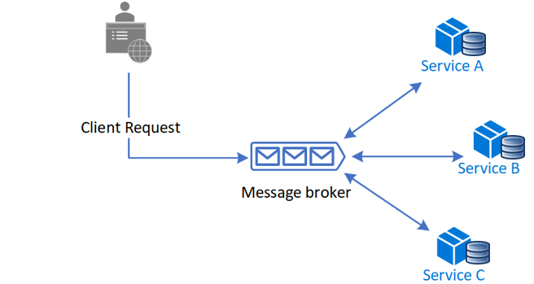
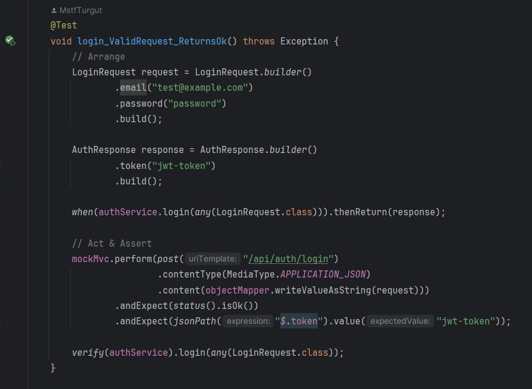

# Hotel Reservation System


A modular monolith hotel software with cqrs, ports & adapters and event-driven support.

<br>

This project took a lot of time and effort. If you like it, please consider giving it a ⭐ star!

<br>

## Table of Contents

[1. Event Storming](#1-event-storming)

[2. UML Modeling](#2-uml-modeling)

[3. Scenarios](#3-scenarios)

[4. Key Assumptions](#4-key-assumptions)

[5. Modules & Integration](#5-modules--integration)

[6. Pattern Usage](#6-pattern-usage)

&nbsp;&nbsp;[6.1 Ports & Adapters](#61-ports--adapters)

&nbsp;&nbsp;[6.2 CQRS](#62-cqrs)

&nbsp;&nbsp;[6.3 SAGA](#63-saga)

&nbsp;&nbsp;[6.4 Design Patterns](#64-design-patterns)

&nbsp;&nbsp;[6.5 Aggregate Tactical Pattern](#65-aggregate-tactical-pattern)

&nbsp;&nbsp;&nbsp;&nbsp;[6.5.1 Raising Domain Events Inside The Aggregate](#651-raising-domain-events-inside-the-aggregate)

[7. Testing](#7-testing)

<br>

## 1. Event Storming

EventStorming is a flexible workshop format for collaborative exploration of complex business domains.

Although event storming is typically a collaborative process involving the entire team, in this project I applied it individually. Although not collaborative in this case, the process still provided clarity and structure to the design.

<br>


You can explore the full event storming board in detail [here](https://miro.com/welcomeonboard/cE1uV2JiRHU3OUdKMnpHNjNIMnNkc2lhWDY2eU5VOXZLcmIxaFpTUnd2WGdYYzNUMStHd0dLbkJEOXFiMUxHVFBRRU9seTBCdkJGNDNoSktFUk1yNWUzZExZYS9rK2htbFZST0lDZFZHMEpuYi9HNFZ3NXFQNkhhQUQ5aHcrZGdBd044SHFHaVlWYWk0d3NxeHNmeG9BPT0hdjE=?share_link_id=756894803956).

<br>

## 2. UML Modeling

<br>

> “A model is a selectively simplified and consciously structured form of knowledge.”
<br> - Eric Evans, Domain Driven Design, Page 12

<br>

The system has undergone significant evolution since my initial modeling attempts, which began with simple paper sketches.

Although the domain itself is relatively straightforward, the design process presented several complex decisions. 

One notable example was the choice to define `RoomType` as a separate aggregate—an approach that required considerable deliberation.

Another challenging decision involved removing the `Availability` class in favor of dynamically checking existing reservations when evaluating the availability of a reservation request. These are just a few examples of the many thoughtful trade-offs made throughout the design process.

The image below displays some of the early conceptual sketches created at the outset of the project. At that time, `RoomType` was treated merely as an enumeration, and the `Availability` class was directly associated with the Room.

<br>


<br>
<br>

The current version of the UML model is shown below:

<br>


<br>
<br>


<br>
<br>


<br>
<br>

The complete UML model is available [here](https://lucid.app/lucidchart/e0c57e48-c5d1-4812-af3d-4a13d766994e/edit?viewport_loc=769%2C-1077%2C19670%2C9584%2C0_0&invitationId=inv_7089af6c-d665-4f91-8786-333e7d46c243). 

<br>

## 3. Scenarios


### Online Reservation
Reservation made directly by the customer online.

#### Flow:
1. **Customer** visits the booking site and selects dates and number of guests.
2. Site checks available rooms and returns suitable room types via:

   ```
   POST /api/reservations/availability
   ```

3. Customer selects room type, enters personal and card details.

4. Site sends request to:

   ```
   POST /api/reservations/create-online
   ```

5. The system sends the reservation code, confirmation code and other details to the customer via SMS and email.


<br>

###  Reservation with Call
This refers to a **reservation made over the phone** by a customer, where the receptionist inputs the details manually.

#### Flow:
1. **Customer calls** and provides necessary reservation details (dates, name, contact info, number of guests, etc.).
2. **Receptionist** checks room availability via:

   ```
   POST /api/reservations/availability
   ```

3. **Receptionist** confirms availability and enters reservation details using:

   ```
   POST /api/reservations/create-online
   ```

4. The system sends the reservation code, confirmation code and other details to the customer via SMS and email.


<br>

###  Face-to-Face Reservation (Typically Same-Day Check-In)
Customer walks in and wants to book and check in immediately.

#### Flow:
1. **Customer provides** check-in/check-out dates, guest count.
2. **Receptionist** checks availability:

   ```
   POST /api/reservations/availability
   ```

3. **Receptionist** creates the reservation:

   ```
   POST /api/reservations/create-in-hotel
   ```

4. **Receptionist receives payment through cash or card**

5. The system sends the reservation code, confirmation code and other details to the customer via SMS and email.

<br>


###  Online Cancellation
Customer logs in and cancels their reservation online.

#### Flow:
1. **Customer logs into their portal**.
2. **System fetches user reservations**:

   ```
   GET /api/reservations/user
   ```

3. **User selects reservation to cancel** and enters confirmation code.
4. **System sends cancellation request**:

   ```
   PUT /api/reservations/{reservationId}/cancel
   ```

<br>

###  Cancellation by Call
Customer calls to cancel their reservation.

#### Flow:
1. **Customer gives reservation info** (code or name + phone).
2. **Receptionist fetches reservation**:

   ```
   GET /api/reservations/{reservationCode}
   OR
   POST /api/reservations/customer
   ```

3. **Receptionist asks for confirmation code**.
4. **Receptionist cancels the reservation**:

   ```
   PUT /api/reservations/{reservationId}/cancel
   ```

<br>

###  Customer Checking In
Customer arrives and wants to check in.

#### Flow:
1. **Customer provides** reservation code or name and phone number.
2. **Receptionist fetches the reservation**:

   ```
   GET /api/reservations/{reservationCode}
   OR
   POST /api/reservations/customer
   ```

3. **Receptionist asks for confirmation code**.
4. **Receptionist checks in the customer**:

   ```
   PUT /api/reservations/{reservationId}/check-in
   ```

5. **Receptionist fetches room details**:

   ```
   GET /api/rooms/{roomId}
   ```

6. **Receptionist gives keys to the guest**.

<br>

###  Customer Checking Out

Customer wants to check out.

#### Flow:
1. **Customer provides reservation code** or name and phone.
2. **Receptionist fetches reservation**:

   ```
   GET /api/reservations/{reservationCode}
   OR
   POST /api/reservations/customer
   ```

3. **Receptionist checks out the reservation**:

   ```
   PUT /api/reservations/{reservationId}/check-out
   ```

4. Reservation is marked as **checked-out**, making the room available for future reservations.
5. **Receptionist collects keys**.

<br>

## 4. Key Assumptions

- A module may only depend on the **integration submodule** (e.g., facades, integration events) of another module. (This is explained in detail in the Modules & Integration section.)


- The **domain model** or **read model** of a module must not be accessed or used by other modules. Instead, communication should occur through well-defined **contracts**.


- Each module maintains its own data in a **separate schema**. Shared data between modules is not allowed.


- All assumptions and guidelines regarding **aggregates** from the *Domain-Driven Design* (DDD) book apply.


- **Business logic must not leak into the application layer.** (Follow the principle of "Tell, Don’t Ask.")


- Dependencies of both the **domain submodule** and the **integration submodule** must be **inverted**, adhering to the Dependency Inversion Principle.


- Each module must modify **only one aggregate instance per transaction**.

<br>

> "And a properly designed bounded context modifies only
one aggregate instance per transaction in all cases."
<br> - Vaughn Vernon, Effective Aggregate Design Part 1

<br>

When a transaction involves multiple aggregates or modules, we rely on eventual consistency.

However, in this project, we aren't even encountering typical issues related to eventual consistency, since it's currently implemented as a modular monolith.

<br>

## 5. Modules & Integration


### Module descriptions


- **Identity Access:** Responsible for user authentication and provides access to current user information for other modules.


- **Reservation (core) :** Provides the main features of the application (e.g., create, cancel, check-in, etc.). 


- **Room Management:** Enables managers to manage rooms and room types (e.g., add, remove, etc.). 


- **Payment:** Handles payment processing and storage. 


- **Notification:** Sends notifications to customers via SMS and email for various events.


- **Shared:** Contains common interfaces and shared domain (kernel) objects. Major modules depend on this module to reuse boilerplate code.


- **Security:** Handles endpoint filtering and authorization.


- **Applicationmain:** Responsible for starting the entire application.

<br>

### Integration


I paid close attention to managing the dependencies between modules and made a strong effort to keep them loosely coupled.

Each module that is expected to be used by others contains an integration submodule. This submodule includes elements such as **facades**, **integration events**, and **contracts**, which serve as translators between dependent modules. The dependencies of the integration submodule are **inverted**; in other words, it has no dependencies on any other submodules within its own module, nor on any external modules.
Service-like classes such as facades are defined as abstract within the integration submodule and are implemented by other submodules as needed.


To demonstrate how modules communicate, here's an example from this project which involves reservation cancellation and how it's handled by the payment module.

Below is the integration submodule of the `reservation` module:;

<br>


<br>


One of the integration events in the `integration-reservation` submodule is `ReservationCancelledIntegrationEvent`. This event is published by a domain event handler in the `application-reservation` submodule.

<br>


<br>

This event is then handled within the `payment` module, as shown below:

<br>


<br>

The `payment` module processes this event by depending solely on the `integration-reservation` submodule of the `reservation` module. Because the dependencies of the integration submodule are inverted, this approach minimizes coupling between the modules.

<br>

## 6. Pattern Usage

This part contains which patterns (high level and low level) are used in this project.

<br>

### 6.1 Ports & Adapters

Most of the modules in this project use ports and adapters pattern.


Ports and Adapters is a software architecture pattern that aims to isolate the core logic of an application from external systems such as databases, user interfaces, messaging systems, and other services. It achieves this separation by introducing "ports" as interfaces through which the core application communicates, and "adapters" as implementations of those interfaces for specific technologies or infrastructures.

<br>

>"Allow an application to equally be driven by users, programs, automated test or batch scripts, and to be developed and tested in isolation from its eventual run-time devices and databases."
<br> - Alistair Cockburn, Hexagonal architecture the original 2005 article

<br>


<br>
<br>

### 6.2 CQRS

Command Query Responsibility Segregation (CQRS) is a design pattern that segregates read and write operations for a data store into separate data models. This approach allows each model to be optimized independently and can improve the performance, scalability, and security of an application.

There are various ways to implement the CQRS pattern. Below is the approach used in this project:


<br>

As shown below, each controller uses command/query buses to dispatch incoming requests to the corresponding command/query handler.

<br>


<br>
<br>

### 6.3 SAGA

The two typical saga implementation approaches are choreography and orchestration. Each approach has its own set of challenges and technologies to coordinate the workflow. 

In the choreography approach, services exchange events without a centralized controller. With choreography, each local transaction publishes domain events that trigger local transactions in other services.

I used the choreography approach for this project. Below is the model illustrating the choreography-based saga:

<br>



<br>
<br>

Here is the event flow model of this project:


<br>
<br>


<br>
<br>


<br>
<br>


<br>

<br>

If you want to have a closer look, you can access to the event flow from [here](https://lucid.app/lucidchart/e0c57e48-c5d1-4812-af3d-4a13d766994e/edit?viewport_loc=769%2C-1077%2C19670%2C9584%2C0_0&invitationId=inv_7089af6c-d665-4f91-8786-333e7d46c243).


<br>

The screenshot below shows the console output log when a 'Create Online Reservation' request is made to the API. The event flow can also be observed in the logs.

<br>


<br>
<br>

### 6.4 Design Patterns

While designing this project, certain parts seemed well-suited for the use of specific design patterns. For those parts, I applied the appropriate pattern. Here's an example from the notification module of the project :

<br>


<br>
<br>


<br>
<br>
<br>


### 6.5 Aggregate Tactical Pattern

The Aggregate is one of the key tactical patterns introduced in the book Domain-Driven Design by Eric Evans. It helps manage complexity and maintain consistency within the domain model.

<br>

**Book definition:**

An AGGREGATE is a cluster of associated objects that we treat as a unit for the purpose of data changes. Each AGGREGATE has a root and a boundary. The boundary defines what is inside the AGGREGATE. The root is a single specific ENTITY contained in the AGGREGATE. The root is the only member of the AGGREGATE that outside objects are allowed to hold references to, although objects within the boundary may hold references to each other


<br>

#### 6.5.1 Raising Domain Events Inside The Aggregate

<br>

> "Instead of dispatching to a domain event handler immediately, what if instead we recorded our domain events, and before committing our transaction, dispatch those domain events at that point? This will have a number of benefits, besides us not tearing our hair out." <br> - Jimmy Boggard, A better domain events pattern, 2014

<br>

In this approach, domain events are not published immediately when they occur. Instead, they are **recorded** within the aggregate root during the execution of business logic. These recorded events are then dispatched only after the aggregate has been persisted—ensuring consistency between the state changes and the events they produce.

To support this, all aggregate roots inherit from a shared abstract base class that provides the functionality to register domain events:

<br>


<br>

Below is an example from the `Reservation` aggregate root. This method demonstrates how a domain event is raised internally as part of the aggregate's behavior:

<br>


<br>

This pattern ensures that domain events remain tightly coupled with the aggregate's lifecycle, promoting consistency, maintaining encapsulation, and reducing the risk of side effects during business operations.

<br>


## 7. Testing


### Unit Testing


Unit tests focus on verifying business behaviors, not just individual methods or classes. Each test should reflect a meaningful scenario within the domain, ideally something that resonates with a business user. These tests are fast, isolated, and help validate the rules and logic embedded in aggregates and domain services.

<br>

#### Samples :


<br>

### Integration Testing


Integration tests validate how multiple components of the system work together — such as repositories, external services, message handlers, and infrastructure code. These tests ensure that the system behaves correctly when all the pieces are wired together, often involving databases, HTTP endpoints, or messaging systems.

<br>

#### Samples :




<br>Mustafa Turgut
<br>mstftrgt00@gmail.com
